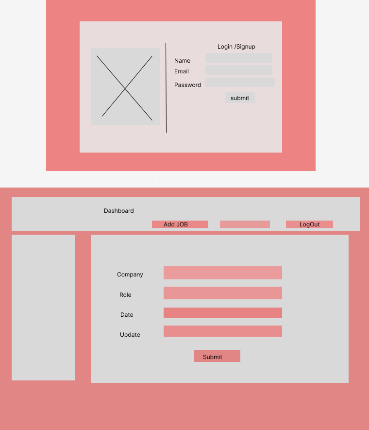
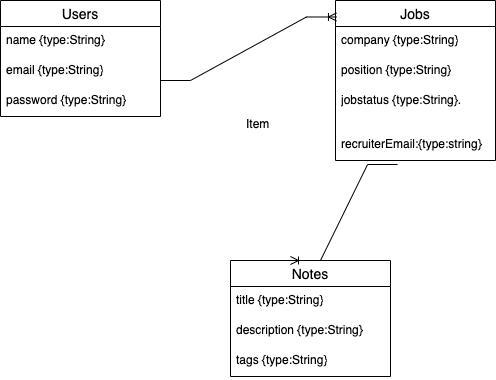

# JobTracker

# Getting Started

# Installation

# About The Project
Job Tracker application built with Mern Stack

## Built With
React, NodeJS, MongoDB,Mongoose, MaterialUI

# Development

## Trello Board
https://trello.com/b/o3DUdF4R/mern-application

## Wireframe

## ERD

## DEMO
https://vercel.com/deenair/mern-app/Hcn9eyUKqt51U7YQbVuye36nwmab

# Features:
1.This is a Job Tracker application which helps you get organized in your job search journey built with Mern Stack
2.It has all the CRUD functionality,features an option to do the entry for all the jobs applied and make necessary changes through the process.
3.It also features an option to prep for interview by taking notes(future enhancement.)

# Future Enhancements:
To display the statical data in a chart

# Acknowledgments
https://www.freecodecamp.org/learn/back-end-development-and-apis/back-end-development-and-apis-projects/exercise-tracker

https://www.youtube.com/watch?v=aibtHnbeuio